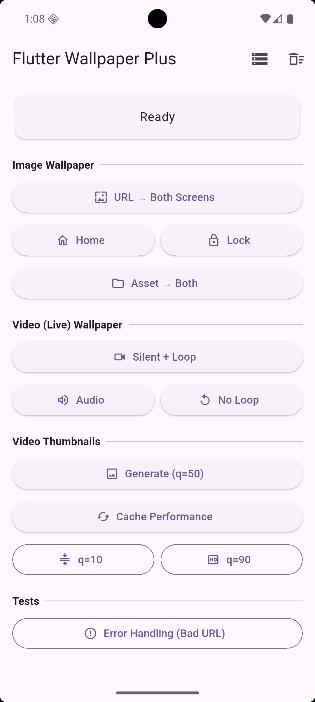

# Flutter Wallpaper Plus

[](https://pub.dev/packages/flutter_wallpaper_plus)
[](https://github.com/Sanaullah49/flutter_wallpaper_plus/blob/main/LICENSE)
[](https://pub.dev/packages/flutter_wallpaper_plus)

Production-grade Flutter plugin for setting **image** and **video (live)** wallpapers on Android.

- Set wallpaper from **asset**, **file**, or **URL**
- Use **typed results** and **structured error codes**
- Generate and cache **video thumbnails**
- Manage cache with **size limits + LRU eviction**
- Handle OEM target limitations with `getTargetSupportPolicy()`
- Normalize oversized image sources before wallpaper apply for better stability
- **Fixed**: Now works on Xiaomi/Redmi/Oppo/Vivo/Realme devices with sequential writes



## Support

If you find this plugin useful, please consider supporting development:

[](https://buymeacoffee.com/sanaullah49)

## Table of Contents

- [Platform Support](#platform-support)
- [Installation](#installation)
- [Android Permissions](#android-permissions)
- [Quick Start](#quick-start)
- [API Reference](#api-reference)
- [Target Behavior and OEM Limitations](#target-behavior-and-oem-limitations)
- [Real Device Results](#real-device-results)
- [Host App Lifecycle](#host-app-lifecycle)
- [FAQ](#faq)
- [Architecture](#architecture)
- [Roadmap](#roadmap)
- [License](#license)

## Platform Support

- Flutter: `>=3.3.0`
- Dart: `^3.11.0`
- Platform: **Android only**
- Android API: **24+**

| Capability | Android Support |
| --- | --- |
| Static image wallpaper | API 24+ |
| Live video wallpaper | API 24+ (device must support live wallpaper feature) |
| Video thumbnail generation | API 24+ |

## Installation

Add the package:

```yaml
dependencies:
  flutter_wallpaper_plus: ^1.0.4
```

Install dependencies:

```bash
flutter pub get
```

## Android Permissions

Permissions are declared by the plugin manifest:

```xml
<uses-permission android:name="android.permission.SET_WALLPAPER" />
<uses-permission android:name="android.permission.INTERNET" />
<uses-permission android:name="android.permission.ACCESS_NETWORK_STATE" />

<uses-permission
    android:name="android.permission.READ_EXTERNAL_STORAGE"
    android:maxSdkVersion="32" />
<uses-permission android:name="android.permission.READ_MEDIA_IMAGES" />
<uses-permission android:name="android.permission.READ_MEDIA_VIDEO" />
```

Permission notes:

- `SET_WALLPAPER`, `INTERNET`, and `ACCESS_NETWORK_STATE` are normal permissions (auto-granted).
- Storage permissions are only needed for `WallpaperSource.file(...)` when reading outside app-internal storage.
- `WallpaperSource.asset(...)` and `WallpaperSource.url(...)` do not require storage read permission.
- Oversized image sources are normalized before apply to reduce memory pressure in the system wallpaper service.

## Quick Start

Import once:

```dart
import 'package:flutter_wallpaper_plus/flutter_wallpaper_plus.dart';
```

### Set Image Wallpaper

```dart
final result = await FlutterWallpaperPlus.setImageWallpaper(
  source: WallpaperSource.url('https://example.com/wallpaper.jpg'),
  target: WallpaperTarget.home,
);

if (result.success) {
  print('Applied: ${result.message}');
} else {
  print('Failed: ${result.errorCode.name} - ${result.message}');
}
```

Notes:

- On Android 12+ (`API 31+`), changing the wallpaper may also update the system's Material You / dynamic color palette.
- This plugin does not provide a separate `setMaterialYouWallpaper(...)` API because that color extraction is handled by Android itself after a normal wallpaper change.

### Set Video (Live) Wallpaper

```dart
final result = await FlutterWallpaperPlus.setVideoWallpaper(
  source: WallpaperSource.url('https://example.com/live.mp4'),
  target: WallpaperTarget.home,
  enableAudio: false,
  loop: true,
  goToHome: false,
);
```

Notes:

- Android opens the **system live wallpaper chooser** and user confirmation is required.
- `WallpaperTarget.lock` is not supported for live video wallpaper (`WallpaperErrorCode.unsupported`).
- Live wallpaper service runs independently after apply (survives app process death).
- Selected live wallpaper video is persisted in app-internal storage so it remains available even after cache cleanup.

### Open Native Wallpaper Chooser

```dart
final result = await FlutterWallpaperPlus.openNativeWallpaperChooser(
  source: WallpaperSource.url('https://example.com/wallpaper.jpg'),
  goToHome: true, // optional best-effort: minimize app before chooser
);
```

`source` is required and supports:

- `WallpaperSource.asset(...)`
- `WallpaperSource.file(...)`
- `WallpaperSource.url(...)`

Source path/URL must be non-empty.

### Get Device Target Support Policy

Use this before rendering target options in UI:

```dart
final policy = await FlutterWallpaperPlus.getTargetSupportPolicy();

if (!policy.allowImageBoth) {
  // Disable "Image -> Both" action in UI
}
```

### Generate Video Thumbnail

```dart
final bytes = await FlutterWallpaperPlus.getVideoThumbnail(
  source: WallpaperSource.url('https://example.com/video.mp4'),
  quality: 50,
  cache: true,
);

if (bytes != null) {
  // Example: Image.memory(bytes)
}
```

### Cache Management

```dart
final size = await FlutterWallpaperPlus.getCacheSize();
print('Cache bytes: $size');

await FlutterWallpaperPlus.setMaxCacheSize(100 * 1024 * 1024); // 100 MB

final clearResult = await FlutterWallpaperPlus.clearCache();
print(clearResult.message);
```

## API Reference

### `FlutterWallpaperPlus`

| Method | Returns | Description |
| --- | --- | --- |
| `setImageWallpaper(...)` | `Future<WallpaperResult>` | Apply static image wallpaper |
| `setVideoWallpaper(...)` | `Future<WallpaperResult>` | Launch system chooser for live wallpaper |
| `openNativeWallpaperChooser(...)` | `Future<WallpaperResult>` | Open native chooser with provided source (asset/file/url) |
| `getVideoThumbnail(...)` | `Future<Uint8List?>` | Extract video thumbnail bytes |
| `getTargetSupportPolicy()` | `Future<TargetSupportPolicy>` | Get device/OEM target reliability policy |
| `clearCache()` | `Future<WallpaperResult>` | Clear cached media + thumbnails |
| `getCacheSize()` | `Future<int>` | Read cache size in bytes |
| `setMaxCacheSize(int)` | `Future<void>` | Set max cache size (bytes) |

### `WallpaperSource`

| Constructor | Meaning |
| --- | --- |
| `WallpaperSource.asset(path)` | Flutter asset declared in `pubspec.yaml` |
| `WallpaperSource.file(path)` | Absolute file path on Android device |
| `WallpaperSource.url(url)` | Remote URL (downloaded and cached) |

### `WallpaperTarget`

| Value | Static image | Live video |
| --- | --- | --- |
| `home` | Supported | Supported |
| `lock` | Supported on compatible devices/OEMs | Unsupported by Android public APIs |
| `both` | Supported on compatible devices/OEMs | System chooser controlled; restricted on some OEMs |

### `WallpaperResult`

| Field | Type | Description |
| --- | --- | --- |
| `success` | `bool` | Operation success flag |
| `message` | `String` | Human-readable outcome |
| `errorCode` | `WallpaperErrorCode` | Structured code for handling |
| `isError` | `bool` | Convenience getter (`!success`) |

### `WallpaperErrorCode`

- `none`
- `sourceNotFound`
- `downloadFailed`
- `unsupported`
- `permissionDenied`
- `applyFailed`
- `videoError`
- `thumbnailFailed`
- `cacheFailed`
- `manufacturerRestriction`
- `unknown`

## Target Behavior and OEM Limitations

This section is important for product behavior and user expectations.

### Live Wallpaper Targeting Rules

- Live wallpaper always uses Android's native chooser flow.
- `WallpaperTarget.lock` for live video is unsupported on public Android APIs.
- Final behavior for live wallpapers can still be altered by OEM system apps/policies.

### Known OEM Restrictions

On some OEM ROMs (commonly Xiaomi/Redmi/Oppo/Vivo/Realme), lock-screen wallpaper behavior may be controlled by system policy (carousel/slideshow/theme engines). In these environments:

- Third-party apps may not reliably force lock wallpaper persistence.
- Lock/both behavior can diverge from what user selected in the system UI.
- Similar behavior is likely on other heavily customized OEM ROMs with lock-screen themes/carousel features.

**v1.0.2 Fix**: The plugin now uses sequential writes with 500ms delay between home and lock screen wallpaper sets, matching the working approach from `async_wallpaper`. This significantly improves reliability on restrictive OEMs. The plugin no longer blocks lock/both targets - it attempts them and relies on the sequential write approach for success.

**v1.0.4 Fix**: Image `lock` and `both` targets now retry with a bitmap-based compatibility fallback after the normalized stream apply path. This better matches the smoother lock-screen behavior seen in older `async_wallpaper` builds on restrictive OEM ROMs.

## Real Device Results

Observed behavior from real testing (as of **February 24, 2026**):

| Device | Image `both` | Video `both` | Notes |
| --- | --- | --- | --- |
| Pixel 6 (emulator) | Works | Works | Smooth and expected behavior |
| Oppo Reno Z | Works (v1.0.2+) | Works | Sequential writes fix |
| Redmi 13C | Works (v1.0.2+) | Works | Sequential writes fix |

**v1.0.2 Update**: The sequential write approach (500ms delay between home and lock) fixes the previous failures on Oppo and Redmi devices.

### Recommended App-Side UX

- Query `getTargetSupportPolicy()` before showing target options.
- Disable unreliable target choices in your UI.
- Prefer `home` target by default on restrictive OEMs.
- Explain to users when device policy may override lock-screen wallpaper behavior.

## Host App Lifecycle

On some devices/ROMs, applying wallpaper can cause the host `FlutterActivity`
to be torn down and recreated. In Logcat this may look like a "cold restart"
or `FlutterEngine` detach/reattach cycle even when wallpaper apply itself succeeds.

This is controlled by the host app lifecycle, not just by the plugin. The plugin
cannot force your app to keep its existing `FlutterEngine`, so if you see this
behavior, make your `MainActivity` more resilient:

- Use `RenderMode.texture`
- Reuse a cached `FlutterEngine`
- Return `false` from `shouldDestroyEngineWithHost()`

Example `MainActivity.kt`:

```kotlin
package com.example.my_app

import android.content.Context
import io.flutter.embedding.android.FlutterActivity
import io.flutter.embedding.android.RenderMode
import io.flutter.embedding.engine.FlutterEngine
import io.flutter.embedding.engine.FlutterEngineCache
import io.flutter.embedding.engine.dart.DartExecutor

class MainActivity : FlutterActivity() {
  companion object {
    private const val ENGINE_ID = "wallpaper_engine"
  }

  override fun getRenderMode(): RenderMode = RenderMode.texture

  override fun provideFlutterEngine(context: Context): FlutterEngine {
    FlutterEngineCache.getInstance().get(ENGINE_ID)?.let { return it }

    val engine = FlutterEngine(context.applicationContext)
    engine.dartExecutor.executeDartEntrypoint(
      DartExecutor.DartEntrypoint.createDefault(),
    )
    FlutterEngineCache.getInstance().put(ENGINE_ID, engine)
    return engine
  }

  override fun shouldDestroyEngineWithHost(): Boolean = false
}
```

The full working example used by this package is in
[`example/android/app/src/main/kotlin/com/example/flutter_wallpaper_plus_example/MainActivity.kt`](example/android/app/src/main/kotlin/com/example/flutter_wallpaper_plus_example/MainActivity.kt).

## FAQ

### Does video wallpaper keep playing if the app is closed?

Yes. Playback is hosted in `WallpaperService` and is independent from your Flutter UI process.

### Why does video wallpaper open a system screen?

Android requires user confirmation for live wallpaper selection.

### Why does "Home only" sometimes affect lock screen?

Some OEMs mirror lock/home wallpaper behavior unless lock wallpaper is independently controlled by the ROM.

### Why does lock wallpaper revert after a few seconds on some devices?

Some ROM features (for example lock-screen slideshow/carousel) can override third-party lock wallpaper shortly after apply.

### Why does my Flutter app cold restart after wallpaper apply?

On some devices the wallpaper change flow can recreate the host Android activity.
If your app uses the default `FlutterActivity` setup, this may look like a full
restart even though the wallpaper apply succeeded. See
[Host App Lifecycle](#host-app-lifecycle) for the recommended `MainActivity`
setup.

### Does this update Material You colors on Android 12+?

Usually yes, if the device/ROM refreshes dynamic colors from the new wallpaper.
That behavior is controlled by Android, so this plugin applies the wallpaper
normally and the system decides whether to regenerate the Material You palette.

### What formats are supported?

- Video: device codec support via MediaCodec/ExoPlayer (MP4 H.264 recommended for best compatibility)
- Image: device-supported bitmap formats (JPEG/PNG/WebP/BMP, etc.)

## Architecture

```text
Flutter (Dart API)
  -> MethodChannel (com.flutterwallpaperplus/methods)
    -> Kotlin plugin layer
      -> ImageWallpaperManager
      -> VideoWallpaperService + ExoPlayer
      -> ThumbnailGenerator
      -> SourceResolver
      -> CacheManager (LRU)
      -> PermissionHelper
```

## Roadmap

Planned next additions:

- Expand OEM policy coverage and reliability hints for more manufacturers
- Add more end-to-end integration testing across Android OEM variants

## License

MIT. See [LICENSE](LICENSE).
